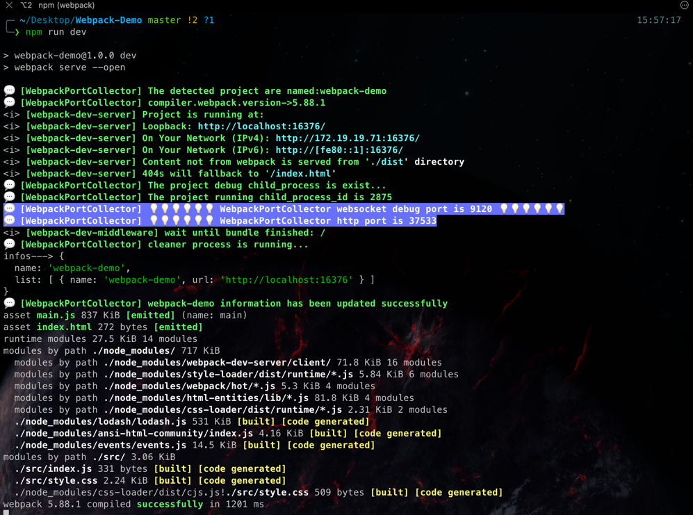

# webpack-port-collector

# Options
| key         | desc                                   |
|-------------|----------------------------------------|
| projectName | the project name what had been started |

